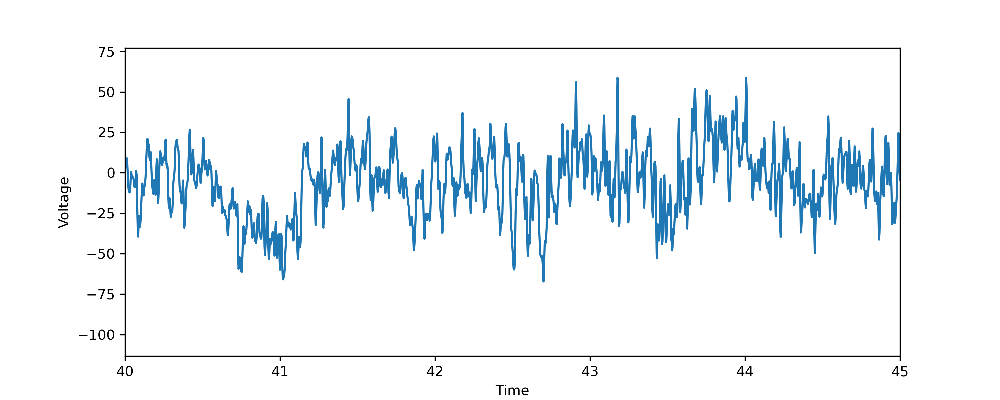
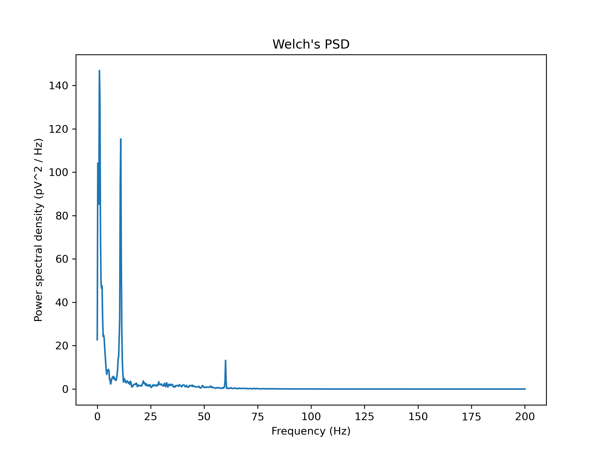
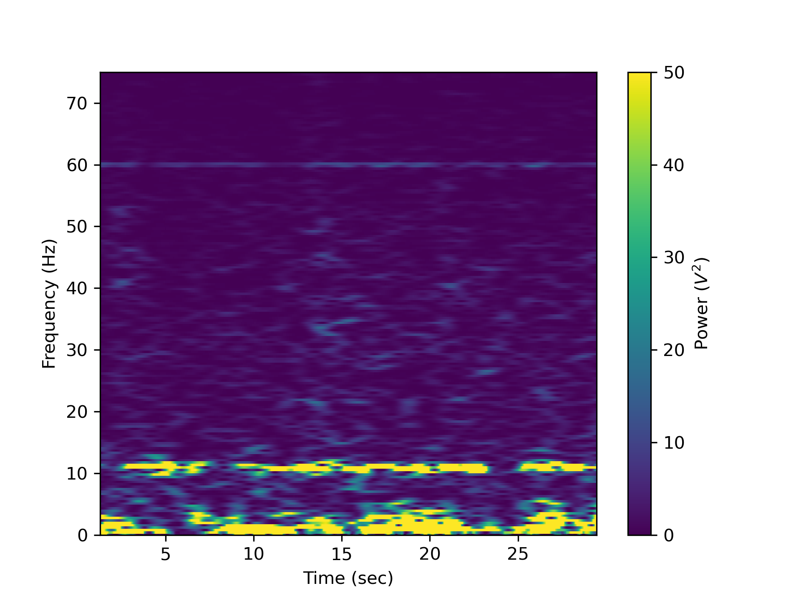
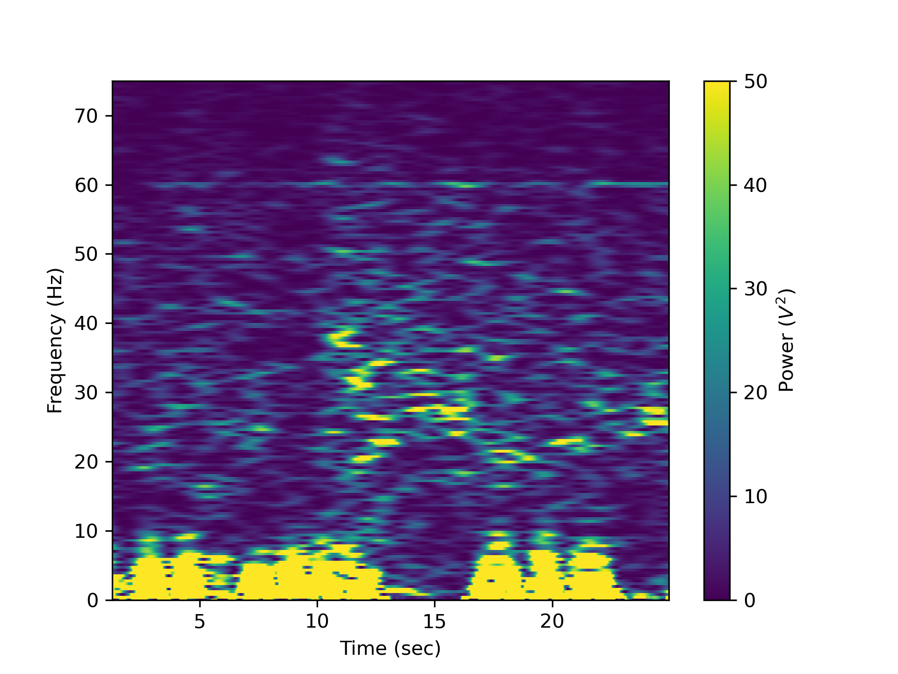

# Mickey x Dave — EEG Alpha Rhythm Analysis

A small signal-processing project on human EEG recorded during an eyes-closed and an
eyes-open condition. The goal is to find the **alpha rhythm** (~8–13 Hz oscillation over
occipital cortex) and show that it appears when the eyes are closed and largely disappears
when they are open — the classic Berger effect.

Everything lives in one notebook, [plots.ipynb](plots.ipynb), which walks from raw trace →
FFT → Welch power spectral density → spectrogram.

---

## Results at a glance

| | Eyes closed (`Alpha_EEG.txt`) | Eyes open (`Open_EEG.txt`) |
|---|---|---|
| Duration | 30.7 s (29.50–60.25 s of session) | 26.2 s (151.25–177.50 s) |
| Samples | 12,300 | 10,500 (9 dropped, interpolated) |
| Signal SD | 22.6 µV | 43.4 µV |
| Peak in 8–13 Hz | **11.00 Hz**, PSD ≈ 115 | 8.75 Hz, PSD ≈ 22 |
| Mean 8–13 Hz PSD | **21.4** | 8.8 |
| 60 Hz (mains) PSD | 13.2 | 23.8 |

**Alpha band power is ~2.4× higher with the eyes closed**, and the eyes-closed spectrum has
a sharp, narrow peak at 11 Hz that the eyes-open spectrum lacks. In the eyes-closed
spectrogram that peak is a continuous bright band sitting at 11 Hz across the whole
recording; in the eyes-open spectrogram there is no band there at all — just broadband
low-frequency and movement/muscle activity. The larger overall SD in the eyes-open trace is
noise (blinks, EMG, movement artefact), not brain rhythm.

| | |
|---|---|
|  |  |
| **Raw trace, eyes closed** (0.5 s zoom). The ~11 Hz oscillation is visible by eye. | **Welch's PSD, eyes closed.** Alpha peak at 11 Hz, plus 1/f low-frequency power and a 60 Hz mains spike. |
|  |  |
| **Spectrogram, eyes closed.** Persistent bright band at 11 Hz. | **Spectrogram, eyes open.** No alpha band; more broadband/high-frequency artefact. |

---

## Data

Both files are ADInstruments **LabChart text exports** (tab-delimited, 6 header lines):

```
Interval=       0.0025 s
ExcelDateTime=  4.6155600778630804e+004  5/13/2026 14:25:07.273702
TimeFormat=     StartOfBlock
DateFormat=
ChannelTitle=   EEG
Range=          200.0 µV
29.5    -26.96875
29.5025 -24.93125
...
```

- Column 1 = time (s, continuing from the start of the full session), column 2 = voltage (µV).
- Sample interval 0.0025 s → **400 Hz sampling rate** (Nyquist 200 Hz), amplifier range ±200 µV.
- Single channel, no filtering or re-referencing applied in software — 60 Hz mains is still present.

| File | Condition |
|---|---|
| `Alpha_EEG.txt` | Eyes closed, resting |
| `Open_EEG.txt` | Eyes open, resting |

Missing samples are marked as blanks and are linearly interpolated on load (`Open_EEG.txt`
has 9; `Alpha_EEG.txt` has none).

---

## Running it

Requires Python 3.12 with NumPy, SciPy, Matplotlib and Jupyter (developed against
NumPy 1.26, SciPy 1.13, Matplotlib 3.8):

```bash
pip install numpy scipy matplotlib jupyter
jupyter notebook plots.ipynb
```

Then **Run All**. The notebook writes its figures next to itself as PNGs at 300 dpi.

To switch a plot from the eyes-closed to the eyes-open recording, swap `closed_recording` /
`closed_timestamps` for `open_recording` / `open_timestamps` in the relevant cell (each cell
has a comment marking the line) and change the `savefig` filename.

---

## Method

1. **Load** — `np.genfromtxt` with `skip_header=6`, tab delimiter, `encoding='unicode_escape'`
   (the `µV` in the header is not UTF-8). NaNs from dropped samples are filled by linear
   interpolation over their neighbours.
2. **Raw trace** — a 0.5 s window (42.2–42.7 s) of the eyes-closed recording, zoomed in far
   enough that individual alpha cycles are countable.
3. **FFT** — `np.fft.fft` normalised by the number of samples, plotted against frequency bins
   from 0 to Nyquist. Quick look; no windowing or averaging, so it is noisy.
4. **Welch's PSD** — `scipy.signal.welch` with a 4 s window (`nperseg = 4 * 400 = 1600`).
   Averaging over overlapping segments trades frequency resolution (0.25 Hz) for a much less
   noisy estimate — this is the plot the numbers above come from.
5. **Spectrogram** — `scipy.signal.spectrogram` with a 1024-point Hanning window and
   1023-sample overlap (maximum time resolution), colour-scaled with `vmax=50` and clipped to
   0–75 Hz so the alpha band is visible against the much larger low-frequency power.

## Files

| Path | What it is |
|---|---|
| [plots.ipynb](plots.ipynb) | The analysis notebook — load, FFT, Welch, spectrogram |
| [plots.html](plots.html) | Static HTML export of the notebook, viewable without Jupyter |
| `Alpha_EEG.txt`, `Open_EEG.txt` | Raw LabChart exports (eyes closed / eyes open) |
| `EEG_signal.png` | Raw eyes-closed trace, 0.5 s zoom |
| `fft_EEG.png` | Unwindowed FFT of the eyes-closed recording |
| `welch.png` | Welch's PSD, eyes closed |
| `closed_spectrogram.png`, `open_spectrogram.png` | Time–frequency spectrograms per condition |
| `spectrogram.png` | Earlier spectrogram render, kept for reference |

---

## Caveats and known quirks

- **Units.** The data are in µV, so PSD is µV²/Hz. The Welch plot's y-axis is labelled
  `pV^2 / Hz` and the spectrogram colourbar `V²`; both are mislabelled — the numbers
  themselves are in µV² units.
- **60 Hz mains noise** is present in both recordings and is *stronger* in the eyes-open
  file. It is left in deliberately (it makes a useful landmark) but should be notch-filtered
  before any quantitative comparison of broadband power.
- **The two conditions are not length-matched** (30.7 s vs 26.2 s) and come from different
  points in one session. Welch's PSD is normalised per Hz so the comparison above is fair,
  but total-power comparisons would not be.
- **No artefact rejection.** Blinks and EMG in the eyes-open trace are what push its SD to
  43 µV; that number is not a measure of brain activity.
- **Cell ordering.** The bare `Sxx.max()` cell (used to pick `vmax`) references a variable
  created by the spectrogram cell *below* it, so it fails on a clean Run All until the
  spectrogram cell has been run once.
- **FFT frequency axis.** The FFT cell builds its bins from 0 to Nyquist over `N/2+1` points
  and then slices the first 1500 of both the bins and the transform — fine for the plotted
  range, but the two arrays are not the same length, so don't reuse that slice logic
  elsewhere.

## Possible next steps

- Notch-filter 60 Hz and high-pass at ~0.5 Hz, then re-run the comparison.
- Plot both conditions on one PSD axis (the notebook has this commented out in the Welch cell).
- Quantify the effect properly: alpha-band power ratio with a confidence interval, or an
  aperiodic-vs-periodic fit (e.g. FOOOF) to separate the 11 Hz peak from the 1/f background.
